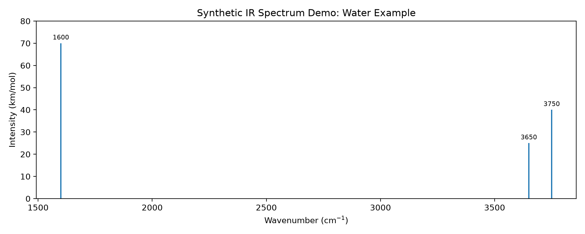

# L-Carnosine Computational Workflow

A reproducible computational workflow and Python toolkit for ORCA-based
geometry optimization and vibrational analysis, developed in the context
of an undergraduate research project in computational physics at the
University of São Paulo (USP).

## Project Status

> **Work in progress**

This repository is currently focused on computational methodology,
workflow development, automation, validation, and reproducibility.

Research results, unpublished molecular structures, and scientific
interpretations are intentionally excluded unless explicitly approved
for public release.

## Scientific Context

The project is motivated by the study of L-carnosine and the relationship
between molecular structure, protonation state, electronic structure,
and vibrational properties.

The computational workflow involves electronic-structure calculations
and vibrational analysis using Density Functional Theory (DFT).

At this stage, the repository should not be interpreted as presenting
definitive scientific conclusions about L-carnosine.

## Goals

The main goals of this repository are to:

- develop a reproducible workflow for ORCA calculations;
- automate the analysis of ORCA outputs with Python;
- validate geometry optimizations and vibrational calculations;
- extract frequencies and infrared intensities;
- generate analysis tables and scientific visualizations;
- compare computational calculations in a structured way;
- document the reasoning behind each step of the workflow.

## Computational Tools

The current workflow uses:

- **ORCA 6** — electronic-structure calculations;
- **Avogadro 2** — molecular structure preparation and visualization;
- **UCSF ChimeraX** — molecular visualization;
- **SEQCROW** — visualization and analysis of quantum-chemistry calculations;
- **Python** — automated parsing, analysis, validation, and visualization;
- **Git/GitHub** — version control and reproducible development.

## Current Features

The current Python toolkit can:

- detect normal ORCA termination;
- detect geometry optimization convergence;
- extract the final electronic energy;
- determine the number of geometry optimization cycles;
- extract vibrational frequencies;
- count imaginary frequencies;
- extract calculated IR frequencies and intensities;
- rank the strongest IR bands;
- generate a compact calculation summary.

The parser is covered by automated tests using synthetic ORCA outputs.

## Command-Line Interface

After installing the project in a Python environment:

```bash
python -m pip install -e ".[dev]"
```

an ORCA output can be summarized directly from the terminal:

```bash
orca-summary calculation.out
```

The number of IR bands displayed can also be controlled:

```bash
orca-summary calculation.out --top-ir 10
```

Example output:

```text
ORCA Calculation Summary
------------------------
Normal termination:       True
Optimization converged:   True
Final energy (Eh):        ...
Optimization cycles:      ...
Imaginary frequencies:    ...

Top IR bands
------------------------
Mode ... | ... cm^-1 | ... km/mol
```

The command reports objective information extracted from the calculation.
It does not determine whether the resulting molecular structure is
chemically or experimentally relevant.

## Public Demonstration

A complete public example is available in [`examples/public/`](examples/public/).

The example uses a simple water molecule to demonstrate the workflow
without exposing unpublished L-carnosine research data.

It includes:

- a public `.xyz` molecular structure;
- an example ORCA `Opt Freq` input;
- a synthetic ORCA-style output;
- instructions for analyzing the demonstration output with `orca-summary`.

The demonstration output contains illustrative values and is explicitly
not presented as the numerical result of the accompanying ORCA input.

See [`examples/public/README.md`](examples/public/README.md) for details.

### Synthetic IR Demonstration

The synthetic ORCA-style output can also be processed programmatically to
generate a simple IR visualization.



The figure is generated with:

```bash
python scripts/generate_water_ir_demo.py

The script uses the project's own ORCA parser to extract IR frequencies
and intensities before plotting them with Matplotlib.

All numerical values shown in this demonstration are synthetic.

## Repository Structure

```text
.
├── docs/                  Project documentation and scientific notes
├── examples/
│   └── public/            Sanitized or explicitly approved examples
├── figures/
│   └── demo/              Demonstration figures safe for publication
├── src/
│   └── carnosine_workflow/
│                           Python analysis tools
├── tests/
│   └── fixtures/
│       └── sanitized/     Sanitized files used for automated tests
├── .gitignore
├── pyproject.toml
└── README.md
```